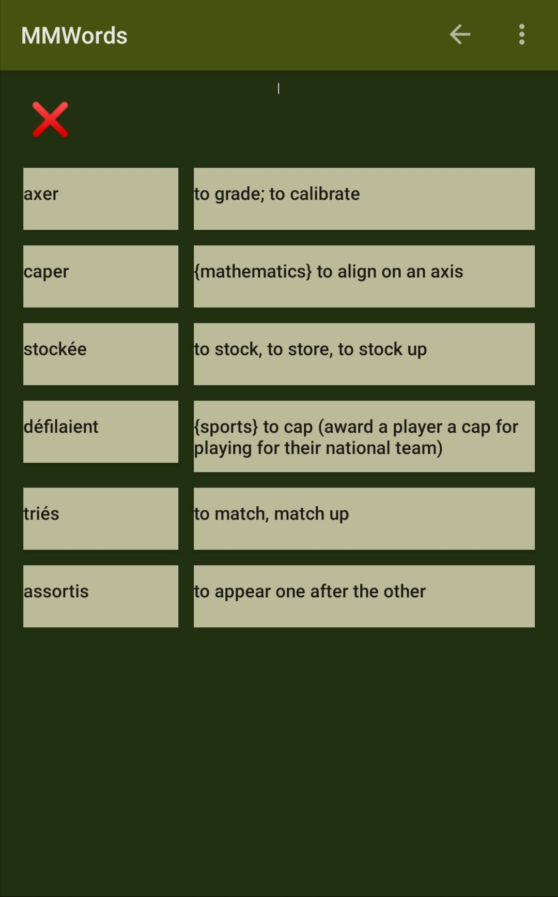

# MensLingua

MensLingua is a powerful Android app guiding the learning and perfecting of language skills, either native or foreign.  Unlike many apps for entry level learnings, MensLingua aims to bring one's skills to advanced levels effectively in a relatively short period of time.

> "mens lingua" in latin means language of the mind.

## How it works

When getting started, you open/create a discipline, for instance English:French discipline for learning French from English.  You can import (at any time) various materials into a discipline: anki files, csv files, text, or even articles from the Internet.  Any material imported into a discipline will be intelligently sorted and added into the study plan with interrelations constructed.  MensLingua's study plan is defined by special algorithms that tracks your combined learning of words, phrases, and sentences so that efficiency and effectiveness are achieved.  Then you simply follow the plans MensLingua sets for you.  As you study, interrelations of the materials are further enriched.

The way to learn is mainly by going through various types of quizzes.  You can see your progress in charts and in journal.

For prononciation, if your material includes audio, then the audio be played, otherwise, the default text-to-speech engine of your phone is used.  The app also includes easy access to online dictionary and online image searches for words and phrases.  And certainly it allows you to use any off-line dictionaries.

But the app doesn't include grammar material for your study, you will need to study it elsewhere.

## How is it different from apps like Anki

"Anki is a program which makes remembering things easy".  There are quite a few apps very similar to Anki for learning languages.

On learning languages (rather than all things), while MensLingua covers Anki's functionality by automatically scheduling learning based on level of ease, the mode of operation is different.  Anki relies on the user to set the level of ease on each element and MensLingua also provides interfaces for the user to do so, but during regluar learning, MensLingua doesn't trust the user's feeling on the level of ease with the element, and rather, the user has to pass a quiz of various kinds to demonstrate his knowledge in order for MensLingua to properly set the right schedule.

More importantly, rather than only for memorizing the materials given, MensLingua focuses more on the full comprehension of an entire language by exploiting the full interrelations of the materials and picking the user from various angles.

## Screenshots

  
  
  
  
  
  

## What are the colors

Colors of words, phrases, and sentences represent levels of ease.  Dark green background color is for the best comfort of the eyes.

## How effective

I used the app to learn French for 1.5 years as I was developing it.  As people knowing me commented: "you knew very little French in the beginning, and now you can basically communicate with with us.  Bravo!".  That's very true, but what they don't know much is that my reading comprehension is already in advanced levels.  I have now read about 10 French books, including (note these are not children's books nor easy books for foreigners):

* L'Étranger by Albert Camus, 150+ pages
* Mort d'une héroïne rouge by Xiaolong Qiu, 500~ pages
* Circé by Madeline Miller, 570+ pages
* La Vallée by Bernard Minier, 520+ pages
* La muse rouge by Véronique de Haas, 440+ pages
* Victime 2117 by Jussi Adler-Olsen, 600+ pages

## Where to get it

The published source codes here are samples.  The app is at a fully functional stage, however, the app will be launched later after marketing plans are finalized.

## How to help

Your contact is highly welcome (by filing an issue here) if you: 1) have substantial marketing prowess; or 2) would like to make a financial contribution; or 3) are a large institution and would consider using the app internally; 
